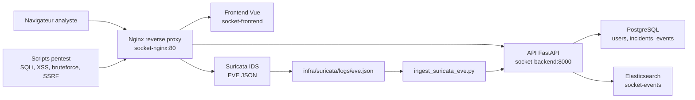

# Architecture technique - SOCket

## Vue d ensemble

SOCket est compose de cinq services Docker principaux, avec un service Suricata optionnel pour la detection IDS live:

- `socket-nginx`: point d entree public sur `http://localhost`.
- `socket-frontend`: interface Vue.js compilee et servie par Nginx.
- `socket-backend`: API FastAPI, authentification, workflow incident et ingestion IDS.
- `socket-postgres`: base SQL pour les utilisateurs, incidents et chronologie.
- `socket-elasticsearch`: base NoSQL pour les evenements de securite et les logs applicatifs.
- `socket-suricata`: IDS optionnel produisant des alertes EVE JSON.

## Flux utilisateur

1. L analyste ouvre `http://localhost`.
2. Nginx sert le frontend et route les appels `/api/` vers FastAPI.
3. L utilisateur se connecte avec `admin` ou `analyst`.
4. FastAPI verifie le mot de passe hash dans PostgreSQL.
5. L API renvoie un jeton d acces utilise par le frontend.
6. Les incidents, commentaires, statuts et assignations sont lus/ecrits dans PostgreSQL.

## Flux detection IDS

1. Les scripts dans `pentest/` envoient des requetes suspectes vers Nginx.
2. En mode live, Suricata inspecte le trafic du reverse proxy et applique les regles IDS locales.
3. Suricata ecrit ses alertes au format EVE JSON dans `infra/suricata/logs/eve.json`. Pour une demonstration reproductible, `infra/suricata/sample_eve.json` fournit le meme format EVE JSON.
4. `infra/scripts/ingest_suricata_eve.py` lit les alertes EVE et les envoie a `/api/v1/ingest/suricata-eve` avec `X-SOCket-Sensor-Token`.
5. FastAPI transforme les alertes Suricata en incidents SOCket avec score, severite, confiance et preuves.
6. FastAPI cree les incidents dans PostgreSQL.
7. Les evenements de securite sont indexes dans Elasticsearch.

## Donnees stockees

### PostgreSQL

PostgreSQL conserve les donnees structurantes du SOC:

- `users`: comptes et roles.
- `incidents`: alertes, score, severite, type d attaque, statut.
- `incident_events`: chronologie, commentaires et changements de statut.

### Elasticsearch

Elasticsearch conserve les evenements techniques utiles a l audit:

- connexions reussies ou echouees;
- creation d incidents;
- modifications d incidents;
- evenements lies a l ingestion IDS.

## Securite d architecture

- Les services internes ne sont pas exposes directement sur la machine hote.
- Seul le reverse proxy publie le port `80`.
- Les secrets sont charges depuis `.env` et ne doivent pas etre versionnes.
- Nginx applique des en-tetes de securite, du rate limiting et bloque les chemins sensibles.
- L ingestion IDS est protegee par un token capteur separe du token utilisateur.
- Les donnees SQL et NoSQL sont persistantes via volumes Docker.
- Suricata peut etre lance avec le profil Docker `suricata` pour separer la detection de l application.

## Limites assumees du prototype

- HTTPS n est pas active en local.
- Le RBAC reste volontairement simple: `admin` et `analyst`.
- La capture Suricata live peut dependre des privileges Docker/WSL; un fichier EVE de demonstration est fourni.
- Elasticsearch est utilise comme brique NoSQL locale, sans tableau Kibana.
