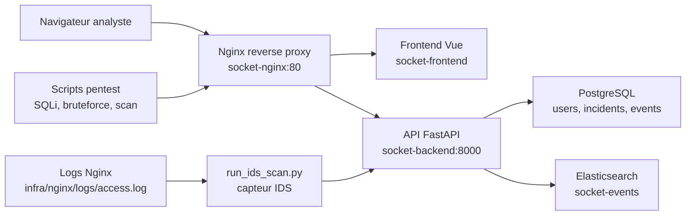

# Architecture technique - SOCket

## Vue d ensemble

SOCket est compose de cinq services Docker relies par un reseau prive:

- `socket-nginx`: point d entree public sur `http://localhost`.
- `socket-frontend`: interface Vue.js compilee et servie par Nginx.
- `socket-backend`: API FastAPI, authentification, workflow incident et ingestion IDS.
- `socket-postgres`: base SQL pour les utilisateurs, incidents et chronologie.
- `socket-elasticsearch`: base NoSQL pour les evenements de securite et les logs applicatifs.

## Flux utilisateur

1. L analyste ouvre `http://localhost`.
2. Nginx sert le frontend et route les appels `/api/` vers FastAPI.
3. L utilisateur se connecte avec `admin` ou `analyst`.
4. FastAPI verifie le mot de passe hash dans PostgreSQL.
5. L API renvoie un jeton d acces utilise par le frontend.
6. Les incidents, commentaires, statuts et assignations sont lus/ecrits dans PostgreSQL.

## Flux detection IDS

1. Les scripts dans `pentest/` envoient des requetes suspectes vers Nginx.
2. Nginx ecrit les requetes dans `infra/nginx/logs/access.log`.
3. `infra/scripts/run_ids_scan.py` lit les nouveaux logs.
4. Le capteur envoie les logs a `/api/v1/ingest/nginx-logs` avec `X-SOCket-Sensor-Token`.
5. `backend/detector.py` classe les attaques et calcule score, severite, confiance et preuves.
6. FastAPI cree des incidents dans PostgreSQL.
7. Les evenements de securite sont indexes dans Elasticsearch.

## Donnees stockees

### PostgreSQL

PostgreSQL conserve les donnees structurantes du SOC:

- `users`: comptes et roles.
- `incidents`: alertes, score, severite, type d attaque, statut.
- `incident_events`: chronologie, commentaires et changements de statut.

### Elasticsearch

Elasticsearch conserve les evenements techniques utiles a l audit:

- connexions reussies ou echouees;
- creation d incidents;
- modifications d incidents;
- evenements lies a l ingestion IDS.

## Securite d architecture

- Les services internes ne sont pas exposes directement sur la machine hote.
- Seul le reverse proxy publie le port `80`.
- Les secrets sont charges depuis `.env` et ne doivent pas etre versionnes.
- Nginx applique des en-tetes de securite, du rate limiting et bloque les chemins sensibles.
- L ingestion IDS est protegee par un token capteur separe du token utilisateur.
- Les donnees SQL et NoSQL sont persistantes via volumes Docker.

## Limites assumees du prototype

- HTTPS n est pas active en local.
- Le RBAC reste volontairement simple: `admin` et `analyst`.
- Le moteur IDS est interne et base sur des regles applicatives, pas sur Suricata.
- Elasticsearch est utilise comme brique NoSQL locale, sans tableau Kibana.
